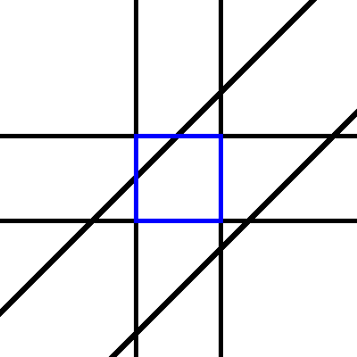

# Fast, Branchless Ray/Bounding Box Intersections

<div class="infobar">

*fa-regular fa-clock* *time-2011-05-02*
*fa-solid fa-user* Tavian Barnes
[*fa-solid fa-comment* Comments](#comments)
[Part 2 *fa-solid fa-circle-chevron-right*](../2015/ray_box_nan.md)

</div>

Axis-aligned bounding boxes (AABBs) are universally used to bound finite objects in ray-tracing.
Ray/AABB intersections are usually faster to calculate than exact ray/object intersections, and allow the construction of bounding volume hierarchies (BVHs) which reduce the number of objects that need to be considered for each ray.
(More on BVHs in a later post.)
This means that a ray-tracer spends a lot of its time calculating ray/AABB intersections, and therefore this code ought to be highly optimised.

The fastest method for performing ray/AABB intersections is the [slab method].
The idea is to treat the box as the space inside of three pairs of parallel planes.
The ray is clipped by each pair of parallel planes, and if any portion of the ray remains, it intersected the box.

[slab method]: http://www.siggraph.org/education/materials/HyperGraph/raytrace/rtinter3.htm

<p style="text-align: center;">

</p>

A simple implementation of this algorithm might look like this (in two dimensions for brevity):

```c
bool intersection(box b, ray r) {
    double tmin = -INFINITY, tmax = INFINITY;

    if (ray.n.x != 0.0) {
        double tx1 = (b.min.x - r.x0.x)/r.n.x;
        double tx2 = (b.max.x - r.x0.x)/r.n.x;

        tmin = max(tmin, min(tx1, tx2));
        tmax = min(tmax, max(tx1, tx2));
    }

    if (ray.n.y != 0.0) {
        double ty1 = (b.min.y - r.x0.y)/r.n.y;
        double ty2 = (b.max.y - r.x0.y)/r.n.y;

        tmin = max(tmin, min(ty1, ty2));
        tmax = min(tmax, max(ty1, ty2));
    }

    return tmax >= tmin;
}
```

However, those divisions take quite a bit of time.
Since when ray-tracing, the same ray is tested against many AABBs, it makes sense to pre-calculate the inverses of the direction components of the ray.
If we can rely on the IEEE 754 floating-point properties, this also implicitly handles the edge case where a component of the direction is zero - the `tx1` and `tx2` values (for example) will be infinities of opposite sign if the ray is within the slabs, thus leaving `tmin` and `tmax` unchanged.
If the ray is outside the slabs, `tx1` and `tx2` will be infinities with the same sign, thus making `tmin == +inf` or `tmax == -inf`, and causing the test to fail.

The final implementation would look like this:

```c
bool intersection(box b, ray r) {
    double tx1 = (b.min.x - r.x0.x)*r.n_inv.x;
    double tx2 = (b.max.x - r.x0.x)*r.n_inv.x;

    double tmin = min(tx1, tx2);
    double tmax = max(tx1, tx2);

    double ty1 = (b.min.y - r.x0.y)*r.n_inv.y;
    double ty2 = (b.max.y - r.x0.y)*r.n_inv.y;

    tmin = max(tmin, min(ty1, ty2));
    tmax = min(tmax, max(ty1, ty2));

    return tmax >= tmin;
}
```

Since modern floating-point instruction sets can compute min and max without branches, this gives a ray/AABB intersection test with no branches or divisions.

My implementation of this in my ray-tracer [Dimension] can be seen [here].

[Dimension]: /dimension
[here]: /cgit/dimension.git/tree/libdimension/bvh/bvh.c#n194


---

## Comments

> **Phil**
> *fa-regular fa-clock* *time-2012-04-01*
>
> This doesn't seem to work out for me for negative direction vectors.
> Looking forward, I can see a box that's there, but looking backwards, I again see the same box mirrored, even though in this direction it's not "there".
> Following the algorithm step by step manually for both a positive and a negative z-dir (with x-dir and y-dir set to 0) gives the same near and far planes in both directions:
>
> ```c
> /*
> box = MIN 0,0,0  MAX 256,256,256
> ray POS 128,128,-512
> case 1: ray DIR 0,0,0.9 -- inverse: (inf,inf,1.1111)
> case 2: ray DIR 0,0,-0.9 -- inverse: (inf,inf,-1.1111)
> */
> picker.tx1, picker.tx2 = (me.Min.X - ray.Pos.X) * ray.invDir.X, (me.Max.X - ray.Pos.X) * ray.invDir.X	//	-inf,inf			-inf,inf
> picker.ty1, picker.ty2 = (me.Min.Y - ray.Pos.Y) * ray.invDir.Y, (me.Max.Y - ray.Pos.Y) * ray.invDir.Y	//	-inf,inf			-inf,inf
> picker.tz1, picker.tz2 = (me.Min.Z - ray.Pos.Z) * ray.invDir.Z, (me.Max.Z - ray.Pos.Z) * ray.invDir.Z	//	-142.22,142.22		142.22,-142.22
> picker.txn, picker.txf = math.Min(picker.tx1, picker.tx2), math.Max(picker.tx1, picker.tx2)		//	-inf,inf			-inf,inf
> picker.tyn, picker.tyf = math.Min(picker.ty1, picker.ty2), math.Max(picker.ty1, picker.ty2)		//	-inf,inf			-inf,inf
> picker.tzn, picker.tzf = math.Min(picker.tz1, picker.tz2), math.Max(picker.tz1, picker.tz2)		//	-142.22,142.22		-142.22,142.22
> picker.tnear = math.Max(picker.txn, math.Max(picker.tyn, picker.tzn))					//	-142.22				-142.22
> picker.tfar = math.Min(picker.txf, math.Min(picker.tyf, picker.tzf))					//	142.22				142.22
> if picker.tfar < picker.tnear {
> 	return true
> }
> ```
>
> > *fa-solid fa-user* [**Tavian Barnes**](/)
> > *fa-regular fa-clock* *time-2012-04-03*
> >
> > Right, because the test is only for whether the line intersects the box at all.
> > The line extends both forwards and backwards.
> > Just add a tmax >= 0 check.
> > It's tmax, not tmin, since tmin will be < 0 if the ray originates inside the box.

> **Sergiy**
> *fa-regular fa-clock* *time-2012-12-30*
>
> Thanks. Works nicely and fast. I updated it a bit, to use SSE (though Vectormath), floats only.
>
> https://gist.github.com/4412640#file-bbox-cpp-L14
>
> > *fa-solid fa-user* [**Tavian Barnes**](/)
> > *fa-regular fa-clock* *time-2013-01-04*
> >
> > You're welcome!
> > I can't see that gist though (says "OAuth failure").
> > What kind of performance did the vectorisation give you?

> [**Bram Stolk**](http://stolk.org/)
> *fa-regular fa-clock* *time-2014-12-29*
>
> To get the actual intersection, would I just use tmin, and multiply it with ray dir, adding ray origin?
> And what if I'm just interested in which face was intersected? x+,x-,y+,y-,z+ or z-?
>
> > *fa-solid fa-user* [**Tavian Barnes**](/)
> > *fa-regular fa-clock* *time-2015-01-11*
> >
> > Yes, that's what I'd do.
> > Except if the ray origin is inside the box (tmin < 0), you need to use tmax instead.
> >
> > To see what face was intersected, there's a few different ways.
> > You can keep track of which slab is intersecting in the above algorithm at all times, but that slows it down.
> >
> > For a cube centered at the origin, a neat trick is to take the component of the intersection point with the largest absolute value.
> >
> > > [**Bram Stolk**](http://stolk.org/)
> > > *fa-regular fa-clock* *time-2015-01-11*
> > >
> > > Thanks Tavianator,
> > >
> > > Yeah, the cube-trick requires sorting. \
> > > So for now I test proximity to face within an epsilon. \
> > > If close enough to face, I assume that face was hit. \
> > > I can live with the few false positives, as I shoot over 100M photons each frame anyway.
> > >
> > > > [**Bram Stolk**](http://stolk.org/)
> > > > *fa-regular fa-clock* *time-2015-01-11*
> > > >
> > > > Oops... that should be 100K photons of course.
> > > >
> > > > > *fa-solid fa-user* [**Tavian Barnes**](/)
> > > > > *fa-regular fa-clock* *time-2015-01-12*
> > > > >
> > > > > Haha I was *really* impressed for a second :)
> > > > >
> > > > > The cube trick does not require sorting, just selecting the max from three candidates.
> >
> > > **Francisco**
> > > *fa-regular fa-clock* *time-2015-03-12*
> > >
> > > So if I return a vec3 with tmin, tmax and a float hit = step(tmin,tmax)\*step(0,tmax), I basically know that if hit > 0 then ro+rd\*tmin is my lower bound intersection point (entry point) and ro+rd\*tmax is my higher bound intersection point (exit point), right?
> > > However, if tmin < 0, I'm inside the bounding box, which means I don't need the entry point and I can just use the ray origin as my starting point.
> > >
> > > > *fa-solid fa-user* [**Tavian Barnes**](/)
> > > > *fa-regular fa-clock* *time-2015-03-12*
> > > >
> > > > Sorry, not sure what you mean by `step()`. You can get the starting point as `ro + td*max(tmin, 0.0)`.
> > > >
> > > > > **Francisco**
> > > > > *fa-regular fa-clock* *time-2015-04-01*
> > > > >
> > > > > step(edge,A) returns 1 if A >= edge, 0 elsewise.
> > > > > So I know if it was a hit if tmax >= tmin AND tmax >= 0.
> > > > > Then we also know tmin is the closest intersection and tmax is the furthest.
> > > > >
> > > > > I implemented this in C++ and it works perfectly for any ray direction.
> > > > > However, in GLSL it seems to have problems with negative directions.

> [**Jon olick**](http://jonolick.com/)
> *fa-regular fa-clock* *time-2015-01-22*
>
> Something to consider here is that 0 \* inf =nan which occurs when the ray starts exactly on the edge of a box
>
> > *fa-solid fa-user* [**Tavian Barnes**](/)
> > *fa-regular fa-clock* *time-2015-01-31*
> >
> > True, if you want consistent handling of that case while staying branch-free, you have to do a little more work.
> > This is worth another post actually, I'll write one up.
> >
> > > **Josh**
> > > *fa-regular fa-clock* *time-2017-08-14*
> > >
> > > Did you do another post?
> > >
> > > > *fa-solid fa-user* [**Tavian Barnes**](/)
> > > > *fa-regular fa-clock* *time-2017-08-16*
> > > >
> > > > Yep: <https://tavianator.com/2015/03/fast-branchless-raybounding-box-intersections-part-2-nans/>

> **Chris**
> *fa-regular fa-clock* *time-2015-03-08*
>
> Thanks for posting this (so long ago)!
> I used this in my own code, and wondered if it is possible to save 2 of the subtractions by taking advantage of the fact that min(x+a, y+a) = min(x,y)+a (for some constant a):
>
> ```c
> r.offset = (r.n_inv.y * r.x0.y) - (r.n_inv.x * r.x0.x);
>
> bool
> intersection(box b, ray r)
> {
>   double tx1 = b.min.x * r.n_inv.x;
>   double tx2 = b.max.x * r.n_inv.x;
>
>   double tmin = min(tx1, tx2) + r.offset;
>   double tmax = max(tx1, tx2) + r.offset;
>
>   double ty1 = b.min.y * r.n_inv.y;
>   double ty2 = b.max.y * r.n_inv.y;
>
>   tmin = max(tmin, min(ty1, ty2));
>   tmax = min(tmax, max(ty1, ty2));
>
>   return tmax >= tmin;
> }
> ```
>
> > *fa-solid fa-user* [**Tavian Barnes**](/)
> > *fa-regular fa-clock* *time-2015-03-11*
> >
> > I think that should work, but there's a couple bugs in your example code.
> > And actually for the test as written you can omit `r.offset` entirely since it doesn't affect the `tmax >= tmin` check at the end.
> > But since you probably want a `tmax >= 0.0` check too, this should work:
> >
> > ```c
> > r.offset = (r.n_inv.y * r.x0.y) + (r.n_inv.x * r.x0.x);
> >
> > bool
> > intersection(box b, ray r)
> > {
> >   double tx1 = b.min.x * r.n_inv.x;
> >   double tx2 = b.max.x * r.n_inv.x;
> >
> >   double tmin = min(tx1, tx2);
> >   double tmax = max(tx1, tx2);
> >
> >   double ty1 = b.min.y * r.n_inv.y;
> >   double ty2 = b.max.y * r.n_inv.y;
> >
> >   tmin = max(tmin, min(ty1, ty2));
> >   tmax = min(tmax, max(ty1, ty2));
> >
> >   return tmax >= max(tmin, r.offset);
> > }
> > ```
> >
> > I'll try it out and see how much faster it is, thanks!

> **Mario**
> *fa-regular fa-clock* *time-2015-05-16*
>
> What if I want to know the 't' of the intersection?
>
> > *fa-solid fa-user* [**Tavian Barnes**](/)
> > *fa-regular fa-clock* *time-2015-05-16*
> >
> > `$t = t_{\min{}}$`, unless `$t_{\min{}} < 0$`, in which case you're inside the box and `$t = t_{\max{}}$`.

> [**Cody Bloemhard**](http://ocdy1001.blogspot.nl/)
> *fa-regular fa-clock* *time-2015-05-29*
>
> Very useful! faster the any method i tried.
> not because of the !(use of divisions), but because the implementation of the slab method is far simpler than others do.
> They use things(slow things) like square roots, DOT products and lots of checks with points.
> now my raycasting method has the speed i wanted.
> Thanks for that.

> **Ciyo**
> *fa-regular fa-clock* *time-2015-12-01*
>
> Hello, many thanks for this useful information!
>
> I have a question about the surface normal. Is there an easy way to get the normal of the intersection point?
>
> Thank you!
>
> > **Phlimy**
> > *fa-regular fa-clock* *time-2016-09-06*
> >
> > I would really like to know too!

> **Diego Sinay**
> *fa-regular fa-clock* *time-2016-05-12*
>
> Hi, great read! \
> One quick question. \
> I had no problem using the first implementation for my ray-tracing algorithm, but can't implement that faster version since I can't get the inverse of the direction vector(doesn't it have to be squared?). \
> Any help is appreciated, Thanks!
>
> > *fa-solid fa-user* [**Tavian Barnes**](/)
> > *fa-regular fa-clock* *time-2016-05-16*
> >
> > You can just compute (1/x, 1/y, 1/z) as the inverse. You don't have to square it.
> >
> > > **SW**
> > > *fa-regular fa-clock* *time-2018-02-27*
> > >
> > > I know this is from a couple of years but ago now, but I’m really confused by this.
> > >
> > > You say you can calculate the inverse of a ray with (1/x, 1/y, 1/z) but I don’t understand that.
> > >
> > > Suppose I had a ray going straight in the x direction (1,0,0). Wouldn’t this give:
> > >
> > > (1/1,1/0,1/0) = (1,0,0)
> > >
> > > Which is surely the same ray?
> > >
> > > Sorry if this is a stupid question!
> > >
> > > > *fa-solid fa-user* [**Tavian Barnes**](/)
> > > > *fa-regular fa-clock* *time-2018-02-27*
> > > >
> > > > 1/0 is not zero. In IEEE 754 arithmetic, it is +inf.
> > > >
> > > > > **SW**
> > > > > *fa-regular fa-clock* *time-2018-02-27*
> > > > >
> > > > > So the inverse of a ray going positive X direction is (1, +inf, +inf)? \
> > > > > I'm having a hard time understanding that! I'm trying to find some sources to explain this but comin up short. \
> > > > > I would have though the inverse ray would be (x*-1, y*-1, z*-1), making an inverse ray of positive X as (-1, 0, 0). Then it's a ray going in the opposite direction. \
> > > > > By the way, thank you for answering, I realise I'm probably asking really stupid questions.
> > > > >
> > > > > > *fa-solid fa-user* [**Tavian Barnes**](/)
> > > > > > *fa-regular fa-clock* *time-2018-02-27*
> > > > > >
> > > > > > The "inverse" is not a ray at all.
> > > > > > It's just three numbers that are the (multiplicative) inverses of the direction components.

> [**Phil**](https://kleinfreund.de/)
> *fa-regular fa-clock* *time-2016-06-23*
>
> Hey there,
>
> considering I have box with min(1,1,1) and max(2,2,2) and a ray with origin(3,3,3) and direction (2,2,2).
> Oh.
> Wait a second.
> I think I just answered my question.
> It's ray direction, not target position.
>
> If I want my ray to go from (3,3,3) towards the direction of point (2,2,2) I need a direction like (-1,-1,-1), correct?
> Oh my, this made me struggle way longer than it should have.
>
> Nevermind me. Thank you for the write-up in both articles. :)

> **Dave**
> *fa-regular fa-clock* *time-2016-09-27*
>
> Does anyone know why this doesn't seem to work in GLSL for all angles?
>
> INFINITY is defined as `const float INFINITY = 1.0 / 0.0;`
>
> ```c
> float rayAABBIntersection (Ray ray, AABB aabb)
> {
> 	float tx1 = (aabb.min.x - ray.origin.x)*ray.inverseDirection.x;
> 	float tx2 = (aabb.max.x - ray.origin.x)*ray.inverseDirection.x;
>
> 	float tmin = min(tx1, tx2);
> 	float tmax = max(tx1, tx2);
>
> 	float ty1 = (aabb.min.y - ray.origin.y)*ray.inverseDirection.y;
> 	float ty2 = (aabb.max.y - ray.origin.y)*ray.inverseDirection.y;
>
> 	tmin = max(tmin, min(ty1, ty2));
> 	tmax = min(tmax, max(ty1, ty2));
>
> 	float tz1 = (aabb.min.z - ray.origin.z)*ray.inverseDirection.z;
> 	float tz2 = (aabb.max.z - ray.origin.z)*ray.inverseDirection.z;
>
> 	tmin = max(tmin, min(tz1, tz2));
> 	tmax = min(tmax, max(tz1, tz2));
>
> 	if (tmin > tmax)
> 	{
> 		return INFINITY;
> 	}
>
> 	if (tmin < 0)
> 	{
> 		return tmax;
> 	}
>
> 	return tmin;
> }
> ```
>
> > *fa-solid fa-user* [**Tavian Barnes**](/)
> > *fa-regular fa-clock* *time-2016-09-29*
> >
> > What do you mean "doesn't work"?
> > What happens?
> > Do you have a numerical example that gets evaluated wrong?
>
> > **skewed**
> > *fa-regular fa-clock* *time-2018-01-31*
> >
> > `INFINITY is defined as const float INFINITY = 1.0 / 0.0;`
> >
> > You can't divide by zero like this.
> > The result is undefined in glsl, which means the implementation is free to do whatever nonsense it wants to when it encounters this statement (except - according to the spec - crash).

> **Ali**
> *fa-regular fa-clock* *time-2017-02-01*
>
> How to find the intersection points of a Cartesian grid and a boundary (e.g. a circle, an ellipse, an arbitrary shape)?
> I am interested in the intersection of the boundary with the cartesian grid.
> Any suggestion/algorithm, kindly email me.

> [**Mark R**](http://www.io7m.com/)
> *fa-regular fa-clock* *time-2017-05-16*
>
> Hello.
>
> Having read both this and part 2, I'm unable to work out what changes I need to make in order to reliably detect intersections when a ray is exactly on the edge of an AABB.
> I have your implementation here with a simple failing test case:
>
> <https://github.com/io7m/raycast-issue-20170516>
>
> I've stepped through the code and tried making the changes you suggested in the other article (exchanging Math.max and Math.min for implementations that have the semantics of maxNumber and minNumber) but I can't seem to get it to work.
>
> Maybe I've misunderstood the intent of the other article: What changes do I need to make to reliably catch ray/edge intersections?
> I care less about efficiency and more about avoiding false negatives.
>
> > *fa-solid fa-user* [**Tavian Barnes**](/)
> > *fa-regular fa-clock* *time-2017-05-17*
> >
> > If you're not concerned with efficiency too much, just take the "naïve" code from part 2 and swap `<=`/`>=` with `<`/`>`:
> >
> > ```c
> > bool intersection(box b, ray r) {
> >     double tmin = -INFINITY, tmax = INFINITY;
> >
> >     for (int i = 0; i < 3; ++i) {
> >         if (ray.dir[i] != 0.0) {
> >             double t1 = (b.min[i] - r.origin[i])/r.dir[i];
> >             double t2 = (b.max[i] - r.origin[i])/r.dir[i];
> >
> >             tmin = max(tmin, min(t1, t2));
> >             tmax = min(tmax, max(t1, t2));
> >         } else if (ray.origin[i] < b.min[i] || ray.origin[i] > b.max[i]) {
> >             return false;
> >         }
> >     }
> >
> >     return tmax >= tmin && tmax >= 0.0;
> > }
> > ```
> >
> > > [**Mark R**](http://www.io7m.com/)
> > > *fa-regular fa-clock* *time-2017-05-17*
> > >
> > > Ah, OK, thanks!

> **Amomum**
> *fa-regular fa-clock* *time-2017-06-09*
>
> Can you please explain what is this 'double t' parameter is?
>
> `static inline bool dmnsn_ray_box_intersection(dmnsn_optimized_ray optray, dmnsn_aabb box, double t)`
>
> It hurts me to say this but I believe that some of the functions do require comments about their input parameters.
> Or more obvious names.
>
> > *fa-solid fa-user* [**Tavian Barnes**](/)
> > *fa-regular fa-clock* *time-2017-06-13*
> >
> > A common way of defining lines (see `dmnsn_ray`) is by the parametric formula `origin + t*direction`.
> > Commonly we restrict `t >= 0` to get a half-line starting from the given origin.
> > So generally `t` specifies a position along a line.
> > In this case, `t` is the closest object intersection found so far, so if the bounding box is farther away than `t`, we can ignore it.
> >
> > I agree that should be better documented! :)

> **Kanzaki**
> *fa-regular fa-clock* *time-2018-04-02*
>
> Hi, thanks a lot for sharing.
>
> I want to know how I can calculate the normal of my cube ?
> I know each side has its own.
> And I know I will only see 3 sides tops at a time.
> But I still don't know how to calculate it...
> Is it box->origin - intersection ? or box->origin - center_of_hit_side ?
>
> Thanks a lot.
>
> > *fa-solid fa-user* [**Tavian Barnes**](/)
> > *fa-regular fa-clock* *time-2018-04-07*
> >
> > <https://tavianator.com/fast-branchless-raybounding-box-intersections-part-2-nans/#comment-52153>
