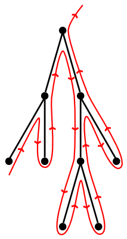

# Iterating Over Binary Trees

<div class="infobar">

<fa:clock-o> 2012-04-19
<fa:user> Tavian Barnes

</div>


Binary trees are great.
If you ever have to implement one yourself though, you're probably either using C or you need to look at the documentation for your language's standard library more closely.
Even POSIX C has the tsearch family of functions from `<search.h>`.

Recently I found myself attempting to implement a bootstrapping compiler in a rather restrictive subset of Java, and found the need for some kind of associative array data structure.
I chose a [splay tree], because, well, I like them.

[splay tree]: https://en.wikipedia.org/wiki/Splay_tree

Soon I found that I wanted the ability to iterate over the entire tree, in sorted order.
This ability is provided by C++'s `std::map::iterator`s, for example.
I considered using a [threaded tree], then an iterator holding a stack, before I realised that there is a much simpler solution with equal performance.
It requires only that the nodes store a reference to their parent node, which mine could with little extra effort.

[threaded tree]: http://en.wikipedia.org/wiki/Threaded_binary_tree

The principle is simple.
If a node has a right subtree, its successor is the minimal (leftmost) node in that subtree.
Otherwise, its successor is the parent of its first ancestor which is not a right child.
In code,

```java
public class Node {
    private Node left, right;

    public Node next() {
        Node next;

        if (right == null) {
            // Node has no right child
            next = this;
            while (next.parent != null && next == next.parent.right) {
                next = next.parent
            }
            next = next.parent;
        } else {
            // Find the leftmost node in the right subtree
            next = right;
            while (next.left != null) {
                next = next.left;
            }
        }

        return next;
    }
}
```

But how fast is this?
An individual call to `node.next()` could traverse from the bottom to the top of the tree, at a cost of `$O(h)$`, where `$h$` is the height of the tree.
If there are `$n$` nodes in the tree, could we traverse `$O(n h)$` edges to visit the whole tree?
This would be particularly bad for a splay tree, which is not necessarily balanced at any given time.

It turns out that we need only traverse `$O(n)$` edges to visit the entire tree.
For an informal proof, note that our algorithm is basically equivalent to tracing an outline of the tree like this:

<p style="text-align: center;">
    
</p>

Clearly we can only trace around any edge at most twice (on its left and right side).
Since any tree has `$n - 1$` edges, we traverse at most `$2 (n - 1) \in O(n)$` edges in the process of exploring the whole tree.
