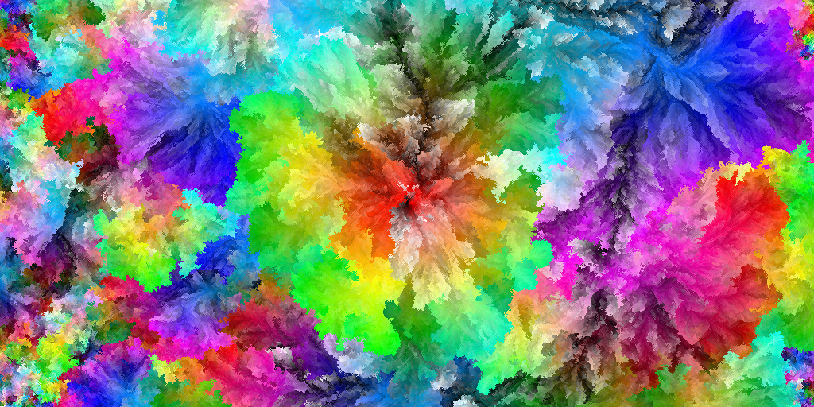
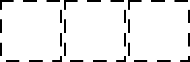

# k-d Forests

<div class="infobar">

*fa-clock-o* *time-2014-03-10*
*fa-user* Tavian Barnes
[*fa-comments* Comments](#comments)
[*fa-reddit* Reddit](https://www.reddit.com/r/programming/comments/205p2a/kd_forests_optimizing_all_rgb_colors_in_one_image/)

</div>


Recently I saw an interesting [Code Golf] problem: [create an image using all possible RGB colours].
The [top ranked submission], by József Fejes, contained some truly beautiful images, but they took an immense amount of time to generate.

[Code Golf]: https://codegolf.stackexchange.com/
[create an image using all possible RGB colours]: http://codegolf.stackexchange.com/questions/22144/images-with-all-colors:
[top ranked submission]: http://codegolf.stackexchange.com/a/22326

As described in the answer and a [follow-up blog post], the images were generated by putting a random colour in the centre, then placing the next colour adjacent to the most similar colour, repeatedly.
The submitted code used exhaustive search over the boundary pixels to find the best location; using some geometric data structures, we can do a lot better.

[follow-up blog post]: http://joco.name/2014/03/02/all-rgb-colors-in-one-image/

The problem of finding where to place the current pixel amounts to finding the [nearest neighbour] to the colour being placed, using Euclidean distance over the RGB colour space.
The most common data structure for nearest neighbour search is the [k-d tree], but they don't perform well in the face of rapid insertion and removal.
Since the boundary changes every time we place a pixel, we'll need a more dynamic data structure.

[nearest neighbour]: https://en.wikipedia.org/wiki/Nearest_neighbor_search
[k-d tree]: https://en.wikipedia.org/wiki/K-d_tree

Usually R-trees are used for problems like these, but I came up with another idea.
Instead of a single k-d tree, we can use a collection of k-d trees (hence the name "k-d forest") with increasing power-of-2 sizes. It looks like this:

[R-trees]: https://en.wikipedia.org/wiki/R-tree

<p style="text-align: center;">

</p>

Rather than re-build a large tree on every insertion, we usually only have to rebuild the first few small trees in the forest.
Since k-d trees can be built in `$O(n \lg n)$` time, we get this performance for n insertions:

```math
\begin{aligned}
\sum_{i=0}^{\lg n} \frac{n}{2^{i+1}} \, O \left( 2^i \, \lg 2^i \right)
& = \sum_{i=0}^{\lg n} O \left( \frac{n}{2^{i+1}} \, i \, 2^i \right) \\
{} & = \sum_{i=0}^{\lg n} O \left( n \, i \right) \\
{} & = O \left( n \, \sum_{i=0}^{\lg n} i \right) \\
{} & = O \left( n \, \lg^2 n \right).
\end{aligned}
```

Allowing node removal destroys this nice amortized performance though, because you could repeatedly remove and add a node right when the largest tree has to get rebuilt.
So we cheat: instead of really deleting nodes, simply set a "removed" flag to `true`.
To avoid wasting time searching through removed nodes, we can rebuild the whole forest without them once they reach, say, 50% of the total nodes.

Query performance is also nice.
Since a single k-d tree takes `$O(\lg n)$` on average to answer a nearest-neighbour query, and we have up to `$O(\lg n)$` trees, our average running time per query is

```math
\begin{aligned}
\sum_{i=0}^{\lg n} O \left( \lg 2^i \right)
& = \sum_{i=0}^{\lg n} O \left( i \right) \\
{} & = O \left( \lg^2 n \right).
\end{aligned}
```

So what's the real-world performance like?
Well, it takes only about four minutes to generate a 4096×4096 image using all possible 24-bit colours.
A straight-across comparison isn't exactly fair due to me using C instead of C♯, but the original code took *dozens of hours* to generate the same images.

<del>Rather than making the images available</del>, I've hosted the code here.
It takes about as long to generate the images (even for the full 24 bit spectrum) as it would to download them anyway.
Simply checkout the code and run `make image` to generate an image.
You can customize some `#defines` in `main.c` to generate different kinds and sizes of images.

<ins>EDIT: Since József Fejes's 24-bit images aren't up anymore, I've shared a Google Drive folder with mine [here](https://drive.google.com/folderview?id=0B2Ib9ClqAzHdNUlOclhQWjR4SU0&usp=drive_web).</ins>

Thanks to József Fejes for the concept.

---


## Comments

> [**Andrew McDowell**](http://www.mcdowella.demon.co.uk/)
> *fa-clock-o* *time-2014-03-12*
>
> There is some more info on this sort of thing at <http://en.wikipedia.org/wiki/Dynamization>, <http://wwwisg.cs.uni-magdeburg.de/ag/lehre/SS2009/GDS/slides/S12.pdf>, and <http://www.mpi-inf.mpg.de/~mehlhorn/ftp/mehlhorn27.pdf>.
>
> > *fa-user* [**Tavian Barnes**](/)
> > *fa-clock-o* *time-2014-03-12*
> >
> > Thanks for the links!
> > I've seen the technique applied before but it's interesting to see the black-box analysis.

> [Leland Batey](http://lelandbatey.com/)
> *fa-clock-o* *time-2014-03-13*
>
> Hey, I encountered some errors with building this, and I wanted to share how I resolved them.
>
> Basically, running `make` yielded linker-errors saying it couldn't find references to a variety of functions in libpng. To fix this, I had to modify the make command to be:
>
> `cc -std=c99 -pipe -O2 -Werror -Wall -Wpedantic -Wextra -Wno-sign-compare -Wno-unused-parameter -Wunreachable-code -Wshadow -Wpointer-arith -Wwrite-strings -Wcast-align -Wstrict-prototypes -lm -lpng -o kd-forest kd-forest.c util.c color.c main.c -lpng`
>
> The change is the addition of `-lpng` on the end.
> That resolved my compilation problem.
>
> > *fa-user* [**Tavian Barnes**](/)
> > *fa-clock-o* *time-2014-03-13*
> >
> > Yeah it's good practice to put the -l\*s after the source files but I forgot. Fixed now, thanks!

> **Gregor_TL**
> *fa-clock-o* *time-2014-03-19*
>
> How did you generate \*hue and \*hue2 images?
> What makes them so different?
>
> > *fa-user* [**Tavian Barnes**](/)
> > *fa-clock-o* *time-2014-03-19*
> >
> > You can see in József's hue-sorted images that there are some artefacts near the edges.
> > This happens because there are naturally "holes" in the image as it's generated, and by the time the purple pixels are being placed, those holes are the only empty places for them.
> >
> > In the \*hue.png images, I've tried to mitigate it by doing multiple passes through the sorted colours.
> > You can see that in the code [here](/cgit/kd-forest.git/tree/main.c?id=8e6ced70cc48dc842b23eaed5c60fb72ae266661#n197).
> > That's why you see multiple "rings" of the entire spectrum.
> >
> > In the \*hue2.png images, I've used a better method. Instead of multiple evenly-spaced stripes, I do every other colour, then every 4th, then every 8th, 16th, etc.
> > You can see that in the code [here](/cgit/kd-forest.git/commit/?id=cd9936f9b09720c949c5fe8262eca45c31244fe3).

> **sammko**
> *fa-clock-o* *time-2014-07-30*
>
> Hi, I rendered a 22-bit animation (2048x2048) and cropped it down to 1080p.
> You can see the result on [YouTube](https://youtu.be/NVmJV7qxClI).
> Thanks for the algorithm :D

> **MrNosco**
> *fa-clock-o* *time-2015-09-01*
>
> You shouldn't use uint8_t pixel[3] notation in function arguments. \
> It might look like sizeof(pixel) should be sizeof(uint8_t[3]), but it's actually sizeof(uint_t*).
>
> > *fa-user* [**Tavian Barnes**](/)
> > *fa-clock-o* *time-2015-09-02*
> >
> > Yeah I read [this thread](https://lkml.org/lkml/2015/9/3/428) too.
> > But because this is my code, I get to have my own opinions on what I should and shouldn't do.
> > The `[3]` is useful documentation.
> > You'd have a point if I actually used `sizeof(pixel)` anywhere, but I don't.

> **Henry**
> *fa-clock-o* *time-2020-01-15*
>
> Hey I'm trying to do something similar a, but I have a question for you.
>
> I understand how the minimum selection would be implemented with the KD-tree by querying for a nearest neighbor to the target color and then placing it in a randomly chosen adjacent location, but how did you do the average selection?
>
> If you were to compute the average color for a location using it's 8 neighbors then you could nearest neighbor between the target and the average and place at the resulting spot.
> But I think that gives a slightly different result to the original guy who minimized the average of the distances to the neighbors , rather than minimizing the distance to the average of the neighbors.
>
> Am I correct in thinking your averaging scheme is slightly different to the original guy's, or if not how did you do nearest neighbor search for the average selection case?
>
> > *fa-user* [**Tavian Barnes**](/)
> > *fa-clock-o* *time-2020-01-30*
> >
> > You're right!
> > I didn't realize that's what the original code did.
> > Actually it looks like the original code computes the average of the \*squared\* distances.
