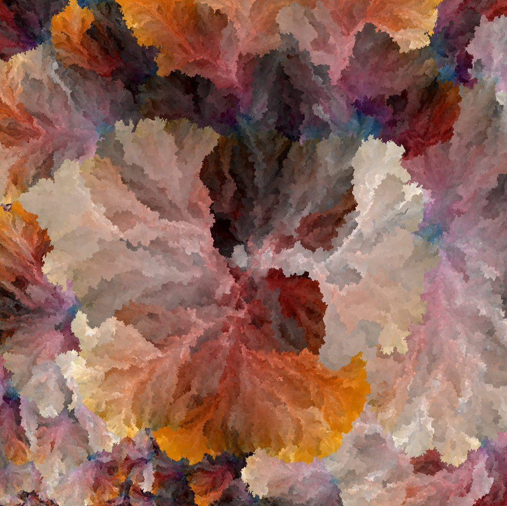

# Porting k-d forests to Rust

<div class="infobar">
    <i class="fa fa-clock-o" aria-hidden="true"></i> 2020-05-03
    <i class="fa fa-user" aria-hidden="true"></i> Tavian Barnes
    <a href="https://www.reddit.com/r/rust/comments/gctk67/porting_kd_forests_to_rust/"><i class="fa fa-reddit" aria-hidden="true"></i> Reddit</a>
</div>

I recently decided to give a serious go to learning [Rust].
As my first non-toy project, I decided to port an old piece of code I'd been wanting to dust off anyway: [k-d forests].
The basic premise of it is to generate images with every possible 8-bit RGB color, by placing each color next to the most similarly-colored pixel placed so far.

[Rust]: https://www.rust-lang.org/
[k-d forests]: ../2014/kd_forests.md

The core functionality of that code is an implementation of [nearest neighbor search] in a [metric space], so an obvious place to start is defining a [trait] to represent a [distance metric].
The most obvious definition would be something like this:

[nearest neighbor search]: https://en.wikipedia.org/wiki/Nearest_neighbor_search
[metric space]: https://en.wikipedia.org/wiki/Metric_space
[trait]: https://doc.rust-lang.org/rust-by-example/trait.html
[distance metric]: https://en.wikipedia.org/wiki/Metric_(mathematics)

```rust,no_run,noplayground
/// A metric space.
pub trait Metric {
    /// Computes the distance between this point and another point.
    fn distance(&self, other: &Self) -> f64;
}
```

I made two enhancements.
The first was to allow distances to be represented by an arbitrary [orderable] type.
Often we just want to know whether one point is closer than another, and we can do that faster than actually computing the exact distances.
This is true with [Euclidean distance], for example, because we can compare distances without taking expensive square roots.
This is known as an [order embedding] of the actual distance.

[orderable]: https://doc.rust-lang.org/std/cmp/trait.Ord.html
[Euclidean distance]: https://en.wikipedia.org/wiki/Euclidean_distance
[order embedding]: https://en.wikipedia.org/wiki/Order_embedding

```rust,no_run,noplayground
// An order embedding for distances.
pub trait Distance: Copy + From<f64> + Into<f64> + Ord {}
```

The second enhancement was to make `Metric` generic, to allow computing distances between different types.
This is useful for nearest neighbor search, where the dataset may have more information than the query points (imagine searching for the closest `Business` to a `GpsLocation`).
The revised `Metric` trait looks like this:

```rust,no_run,noplayground
/// A metric space.
pub trait Metric<T: ?Sized = Self> {
    /// The type used to represent distances.
    type Distance: Distance;

    /// Computes the distance between this point and another point.
    fn distance(&self, other: &T) -> Self::Distance;
}
```

To actually perform nearest neighbor searches against a set of points, we need data structures that index those points:

```rust,no_run,noplayground
/// A nearest neighbor to a target.
pub struct Neighbor<T> {
    /// The found item.
    pub item: T,
    /// The distance from the target.
    pub distance: f64,
}

/// A nearest neighbor search index.
pub trait NearestNeighbors<T, U: Metric<T> = T> {
    /// Returns the nearest match to `target` (or `None` if this index is empty).
    fn nearest(&self, target: &U) -> Option<Neighbor<&T>>;

    /// Returns the nearest match to `target` within the `threshold`, if one exists.
    fn nearest_within(&self, target: &U, threshold: f64) -> Option<Neighbor<&T>>;

    /// Returns the up to `k` nearest matches to `target`.
    fn k_nearest(&self, target: &U, k: usize) -> Vec<Neighbor<&T>>;

    /// Returns the up to `k` nearest matches to `target` within the `threshold`.
    fn k_nearest_within(
        &self,
        target: &U,
        k: usize,
        threshold: f64,
    ) -> Vec<Neighbor<&T>>;
}
```

These methods could all be implemented in terms of the ones below them, e.g. `fn nearest(...) { self.k_nearest(target, 1).pop() }`.
But it will be handy to introduce a special type for accumulating results during a search:

```rust,no_run,noplayground
/// Accumulates nearest neighbor search results.
pub trait Neighborhood<T, U: Metric<T>> {
    /// Returns the target of the nearest neighbor search.
    fn target(&self) -> U;

    /// Check whether a distance is within this neighborhood.
    fn contains(&self, distance: f64) -> bool {
        distance < 0.0 || self.contains_distance(distance.into())
    }

    /// Check whether a distance is within this neighborhood.
    fn contains_distance(&self, distance: U::Distance) -> bool;

    /// Consider a new candidate neighbor.
    fn consider(&mut self, item: T) -> U::Distance;
}
```

The `nearest*()` methods use a [simple implementation] that keeps track of the best match seen so far.
The `k_nearest*()` methods use a [more complicated implementation] that keeps track of the `k` best matches so far with a priority queue.
Ultimately, all of the `NearestNeighbors` functionality can be provided by implementing just one method:

[simple implementation]: https://github.com/tavianator/kd-forest/blob/8aa2911b4c978ad7131a430d07a580cedf6f8f65/src/metric.rs#L179-L239
[more complicated implementation]: https://github.com/tavianator/kd-forest/blob/8aa2911b4c978ad7131a430d07a580cedf6f8f65/src/metric.rs#L241-L318

```rust,no_run,noplayground
pub trait NearestNeighbors<T, U: Metric<T> = T> {
    ...
    /// Search for nearest neighbors and add them to a neighborhood.
    fn search<'a, 'b, N>(&'a self, neighborhood: N) -> N
    where
        T: 'a,
        U: 'b,
        N: Neighborhood<&'a T, &'b U>;
}
```

The simplest possible implementation just does an exhaustive search:

```rust,no_run,noplayground
/// A NearestNeighbors implementation that does exhaustive search.
pub struct ExhaustiveSearch<T>(Vec<T>);
impl<T, U: Metric<T>> NearestNeighbors<T, U> for ExhaustiveSearch<T> {
    fn search<'a, 'b, N>(&'a self, neighborhood: N) -> N
    where
        T: 'a,
        U: 'b,
        N: Neighborhood<&'a T, &'b U>,
    {
        for e in &self.0 {
            neighborhood.consider(e);
        }
        neighborhood
    }
}
```


## Vantage-point trees

Before covering k-d trees, I'm going to go over my implementation of [vantage-point trees] (VP trees).
VP trees are structurally similar to k-d trees, but more general as they work for any metric space, not just `$\mathbb{R}^n$`.
Every node in a VP tree holds a point and a radius, and two subtrees for the points inside/outside the radius.

[vantage-point trees]: https://en.wikipedia.org/wiki/Vantage-point_tree

```rust,no_run,noplayground
/// A node in a VP tree.
struct VpNode<T> {
    /// The vantage point itself.
    item: T,
    /// The radius of this node.
    radius: f64,
    /// The subtree inside the radius, if any.
    inside: Option<Box<Self>>,
    /// The subtree outside the radius, if any.
    outside: Option<Box<Self>>,
}

/// A vantage-point tree.
pub struct VpTree<T> {
    /// The root node of the tree.
    root: Option<Box<VpNode<T>>>,
}
```

Searching is fairly simple: we recurse down the tree, using the triangle inequality property of metric spaces to prune subtrees.
For a target point `$t$`, current distance threshold `$\tau$`, and a node with point `$p$` and radius `$r$`, it's only necessary to search the "inside" subtree when `$d(t,p) - r \le \tau$`.
Similarly, we only need to search the outside subtree when `$r - d(t,p) \le \tau$`.
As a heuristic, we search the subtree that contains the target point first.
In code, that looks like:

```rust,no_run,noplayground
impl<'a, T, U, N> VpSearch<'a, T, U, N> for VpNode<T>
where
    T: 'a,
    U: Metric<&'a T>,
    N: Neighborhood<&'a T, U>,
{
    fn search(&'a self, neighborhood: &mut N) {
        let distance = neighborhood.consider(&self.item).into();
        if distance <= self.radius {
            self.search_inside(distance, neighborhood);
            self.search_outside(distance, neighborhood);
        } else {
            self.search_outside(distance, neighborhood);
            self.search_inside(distance, neighborhood);
        }
    }

    fn search_inside(&'a self, distance: f64, neighborhood: &mut N) {
        if let Some(inside) = &self.inside {
            if neighborhood.contains(distance - self.radius) {
                inside.search(neighborhood);
            }
        }
    }

    fn search_outside(&'a self, distance: f64, neighborhood: &mut N) {
        if let Some(outside) = &self.outside {
            if neighborhood.contains(self.radius - distance) {
                outside.search(neighborhood);
            }
        }
    }
}
```


## k-d trees

[k-d trees] have a similar structure.
Every node in a k-d tree holds a point `$p$`, and splits its children into two subtrees based on a coordinate `$i$`.
Points `$q$` with `$q_i < p_i$` go in the left subtree, and those with `$q_i > p_i$` go in the right.

[k-d trees]: https://en.wikipedia.org/wiki/K-d_tree

```rust,no_run,noplayground
/// A node in a k-d tree.
struct KdNode<T> {
    /// The value stored in this node.
    item: T,
    /// The left subtree, if any.
    left: Option<Box<Self>>,
    /// The right subtree, if any.
    right: Option<Box<Self>>,
}

/// A k-d tree.
pub struct KdTree<T> {
    root: Option<Box<KdNode<T>>>,
}
```

In order to extract coordinate values from points, we define a trait to represent points embedded in [Cartesian space]:

[Cartesian space]: https://en.wikipedia.org/wiki/Cartesian_coordinate_system

```rust,no_run,noplayground
/// A point in Cartesian space.
pub trait Cartesian: Metric<[f64]> {
    /// Returns the number of dimensions necessary to describe this point.
    fn dimensions(&self) -> usize;

    /// Returns the `i`th coordinate of this point (`i < self.dimensions()`).
    fn coordinate(&self, i: usize) -> f64;
}

/// Marker trait for cartesian metric spaces.
pub trait CartesianMetric<T: ?Sized = Self>:
    Cartesian + Metric<T, Distance = <Self as Metric<[f64]>>::Distance>
{
}
```

With that out of the way, the k-d tree implementation is also simple:

```rust,no_run,noplayground
impl<T: Cartesian> KdNode<T> {
    /// Recursively search for nearest neighbors.
    fn search<'a, U, N>(&'a self, i: usize, closest: &mut [f64], neighborhood: &mut N)
    where
        T: 'a,
        U: CartesianMetric<&'a T>,
        N: Neighborhood<&'a T, U>,
    {
        neighborhood.consider(&self.item);

        let target = neighborhood.target();
        let ti = target.coordinate(i);
        let si = self.item.coordinate(i);
        let j = (i + 1) % self.item.dimensions();

        let (near, far) = if ti <= si {
            (&self.left, &self.right)
        } else {
            (&self.right, &self.left)
        };

        if let Some(near) = near {
            near.search(j, closest, neighborhood);
        }

        if let Some(far) = far {
            let saved = closest[i];
            closest[i] = si;
            if neighborhood.contains_distance(target.distance(closest)) {
                far.search(j, closest, neighborhood);
            }
            closest[i] = saved;
        }
    }
}
```

We can [optimize the layout] [a bit] by storing all the nodes together in a flat `Vec` rather than separate `Boxes`.

[optimize the layout]: https://github.com/tavianator/kd-forest/commit/9699f4657ecaaf4361448f249e4f2e210a854af4
[a bit]: https://github.com/tavianator/kd-forest/commit/e9a81a6d0df149252164003975addf175d5c6f4b


## Dynamization

k-d trees and VP trees are typically constructed by bulk-loading all points up front.
While it's possible to add and remove points from these trees after construction, doing so tends to unbalance the trees.
Luckily, there is a general technique to create a dynamic data structure from a static one called "[dynamization]."
k-d forests are a straightforward application of dynamization to k-d trees.

[dynamization]: https://en.wikipedia.org/wiki/Dynamization

To dynamize insertion, we replace our single tree with multiple trees of exponentially increasing size.
As described in the original post, we typically only have to rebuild a few small trees on every insertion.
Think of it like incrementing a binary number; only when we have a carry at a particular bit do we have to rebuild the corresponding tree.

[original post]: ../2014/kd_forests.md

```rust,no_run,noplayground
/// A dynamic wrapper for a static nearest neighbor search data structure.
pub struct Forest<T>(Vec<Option<T>>);

impl<T, U> Forest<U>
where
    U: FromIterator<T> + IntoIterator<Item = T>,
{
    /// Add a new item to the forest.
    pub fn push(&mut self, item: T) {
        let mut items = vec![item];

        for slot in &mut self.0 {
            match slot.take() {
                // Collect the items from any trees we encounter...
                Some(tree) => {
                    items.extend(tree);
                }
                // ... and put them all in the first empty slot
                None => {
                    *slot = Some(items.into_iter().collect());
                    return;
                }
            }
        }

        self.0.push(Some(items.into_iter().collect()));
    }
}

/// Implement NearestNeighbors for Forest<V> whenever it's implemented for V.
impl<T, U, V> NearestNeighbors<T, U> for Forest<V>
where
    U: Metric<T>,
    V: NearestNeighbors<T, U>,
{
    fn search<'a, 'b, N>(&'a self, neighborhood: N) -> N
    where
        T: 'a,
        U: 'b,
        N: Neighborhood<&'a T, &'b U>,
    {
        self.0
            .iter()
            .flatten()
            .fold(neighborhood, |n, t| t.search(n))
    }
}
```

This can be [optimized further] in the case that multiple elements are inserted at once.

[optimized further]: https://github.com/tavianator/kd-forest/commit/b4a39a3f22fac361f6a535d281eee5586078281b


## Soft deletion

To dynamize deletion, we do a "soft delete": simply set a deleted flag to true for that item.
When the number of deleted items reaches a threshold fraction of the total size, we rebuild the trees without those items.
A custom Neighborhood implementation lets us easily skip the deleted items during searches, without having to modify the underlying trees at all!
I think that's pretty slick.

```rust,no_run,noplayground
/// A trait for objects that can be soft-deleted.
pub trait SoftDelete {
    /// Check whether this item is deleted.
    fn is_deleted(&self) -> bool;
}

/// Neighborhood wrapper that ignores soft-deleted items.
struct SoftNeighborhood<N>(N);

impl<T, U, N> Neighborhood<T, U> for SoftNeighborhood<N>
where
    T: SoftDelete,
    U: Metric<T>,
    N: Neighborhood<T, U>,
{
    fn target(&self) -> U {
        self.0.target()
    }

    fn contains_distance(&self, distance: U::Distance) -> bool {
        self.0.contains_distance(distance)
    }

    fn consider(&mut self, item: T) -> U::Distance {
        if item.is_deleted() {
            self.target().distance(&item)
        } else {
            self.0.consider(item)
        }
    }
}

/// A NearestNeighbors implementation that supports soft deletes.
pub struct SoftSearch<T>(T);

impl<T, U, V> NearestNeighbors<T, U> for SoftSearch<V>
where
    T: SoftDelete,
    U: Metric<T>,
    V: NearestNeighbors<T, U>,
{
    fn search<'a, 'b, N>(&'a self, neighborhood: N) -> N
    where
        T: 'a,
        U: 'b,
        N: Neighborhood<&'a T, &'b U>,
    {
        self.0.search(SoftNeighborhood(neighborhood)).0
    }
}
```


## Results

This code is available on GitHub [here].
I had a good experience re-writing it in Rust.
I had to ask a [couple] [questions], but got good answers quickly and with a minimum of trademarked Stack Overflow condescension.
Prior to this, the only Rust I had written were [these 36 lines] which were actually just rearranged from existing code, so I was surprised how easy it was to pick up — with the caveat that I've been reading about Rust for quite a while now, even if I hadn't written much.

[here]: https://github.com/tavianator/kd-forest
[couple]: https://stackoverflow.com/q/60953455/502399
[questions]: https://users.rust-lang.org/t/how-can-i-write-a-container-that-allows-removal-by-handle/40413
[these 36 lines]: https://github.com/sharkdp/fd/commit/5cbd8405ec14e4fc1c2e90836bf398908e5b8145

The new code is quite a bit more general than the [old C code], which had the data structure hard-coded to its application of picking nearby colors.
Despite the extra levels of abstraction, the Rust implementation is only about 10–20% slower than the C one.
And there's even a k-d tree building optimization in the C version that I didn't get around to implementing in Rust, since it requires a bit of tricky interior mutability.
That'll probably be the subject of a future post.

[old C code]: https://github.com/tavianator/kd-forest/blob/d95e93bf70f3351e6fd489284794ef7909fd94ce/kd-forest.c

The extra generality let me easily implement a couple new features too: you can now use an existing image as the source of colors, instead of the all-RGB-colors cube (that's how I generated the banner image, from [this painting]).
And you can use an image as a target too, placing pixels over their closest counterparts in a given image.
Finally, I rendered some videos of the images being generated, which you can find on [this YouTube playlist] <ins>(updated to fix [YouTube issues])</ins>.

[this painting]: https://www.instagram.com/p/BpUbPFMhknJ/
[this YouTube playlist]: https://www.youtube.com/watch?v=f7rF2LAfBwY&list=PLgSor9XFvfk_nrrr9B2CpgURF4KMWaV4T
[YouTube issues]: https://www.reddit.com/r/rust/comments/gctk67/porting_kd_forests_to_rust/fpesdy3/?context=3
