# `bfs`

[*fa-github* GitHub](https://github.com/tavianator/bfs)

Breadth-first search for your files.

`bfs` is a variant of the UNIX `find` command that operates [**breadth-first**](https://en.wikipedia.org/wiki/Breadth-first_search) rather than [**depth-first**](https://en.wikipedia.org/wiki/Depth-first_search).
It is otherwise compatible with many versions of `find`, including

[**POSIX**](http://pubs.opengroup.org/onlinepubs/9799919799/utilities/find.html)
[**GNU**](https://www.gnu.org/software/findutils/)
[**FreeBSD**](https://www.freebsd.org/cgi/man.cgi?find(1))
[**OpenBSD**](https://man.openbsd.org/find.1)
[**NetBSD**](https://man.netbsd.org/find.1)
[**macOS**](https://ss64.com/osx/find.html)

If you're not familiar with `find`, the [GNU find manual](https://www.gnu.org/software/findutils/manual/html_mono/find.html) provides a good introduction.
